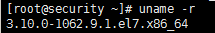
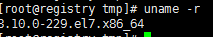

# 如何把centos内核升级成指定版本

#### 从3.10.0-1062.9.1.el7升级至3.10.0-229.el7

查看当前内核版本：




#### 下载

谷歌搜索并下载类似命名的文件：

kernel-3.10.0-229.el7.x86_64.rpm
~~kernel-tools-3.10.0-229.el7.x86_64.rpm~~
~~kernel-tools-libs-3.10.0-229.el7.x86_64.rpm~~


#### 安装

```bash
# yum install kernel-3.10.0-229.el7.x86_64.rpm
```
如果安装失败就用rpm强制安装
```bash
# rpm -ivh --force kernel-3.10.0-229.el7.x86_64.rpm
准备中...                          ################################# [100%]
正在升级/安装...
   1:kernel-3.10.0-229.el7            ################################# [100%]
```


#### 安装kernel-devel（可选）

谷歌搜索下载并安装kernel-devel文件以免编译内核错误

```bash
# yum install kernel-devel-3.10.0-229.el7.x86_64.rpm
```


#### 重启检查更新是否成功

