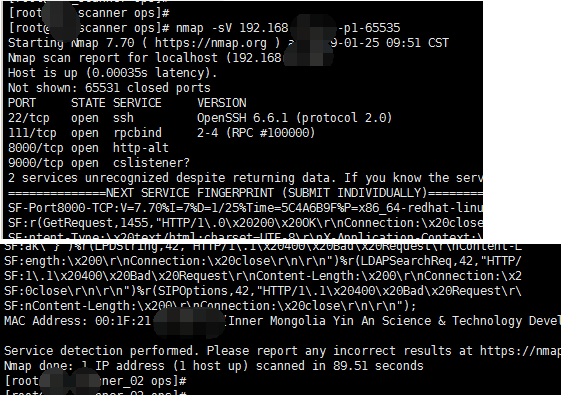
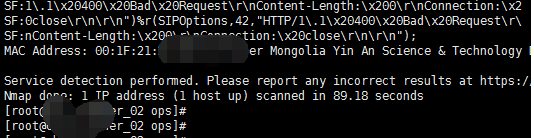
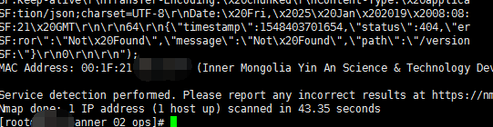
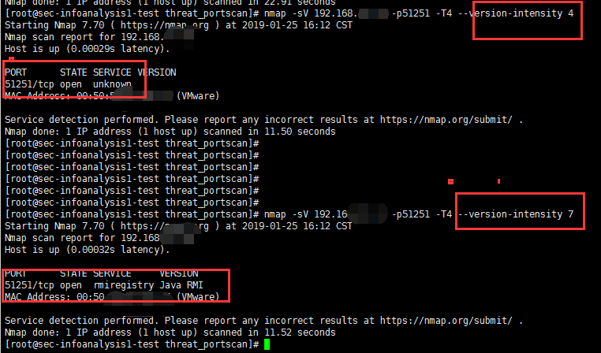
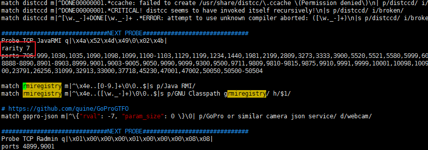
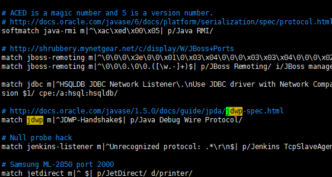
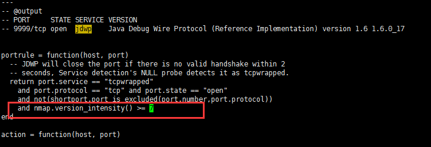
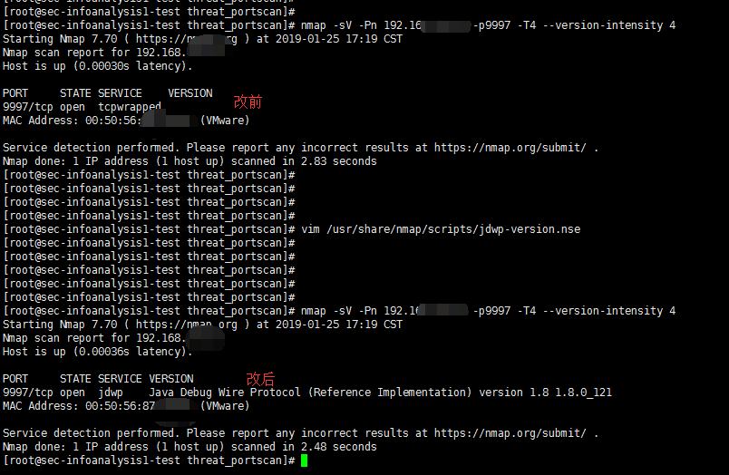

[toc]
## 缩短 nmap 扫描时间

### 修改前

首先看下扫描一个 ip 所用的时间大概在89秒左右：
`nmap -sV 192.168.xxx.xxx -p1-65535`

### 修改后

接着添加 -T4参数看看速度是否有变化，可以看到也是89秒左右：

接着继续添加 --version-intensity 4参数，可以看到速度缩短到43秒左右：

### 解决部分指纹识别不出

但是带来的影响是有些指纹识别不出来，如下图：

这就需要把没有识别出来的指纹手动进行修改。首先在 /usr/share/nmap/nmap-service-probes 里查找 rmiregistry，然后把 rarity 的值改成4就行了

但是有些指纹并没有 rarity，如：jdwp

这时候可以通过`grep -r "Java Debug Wire Protocol" /usr/share/nmap/`查找 rarity 的判断在哪个文件，后来找到在 /usr/share/nmap/scripts/jdwp-version.nse 文件里，修改成4，这样就可以--version-intensity 4的时候也识别出来了

