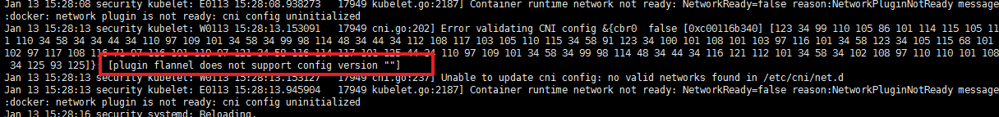

## 1. plugin flannel does not support config version的错误

### 1.1. 报错  

在master上看node发现NotReady，接着去问题node查看日志【journalctl -f -u kubelet】，提示  

  

### 1.2. 原因  

从网上查到，应该是/etc/cni/net.d/10-flannel.conf文件里少了cniVersion版本，加上就可以解决。  

```bash
# cat /etc/cni/net.d/10-flannel.conf
{
  "name": "cbr0",
"cniVersion": "0.2.0",
  "type": "flannel",
  "delegate": {
    "isDefaultGateway": true
  }
}
# systemctl daemon-reload
```