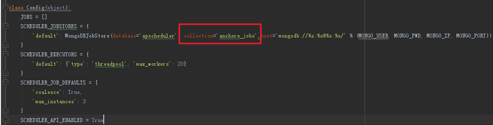

## 1. 使用apscheduler的一个坑

### 1.1. 起因  

之前使用apscheduler+flask跑定时任务，刚开始一段时间内一切正常，后来某天查看定时任务的时候，发现任务消失了，这让人感到非常困惑。  

### 1.2. 原因
  
之后加了大量logging记录日志，发现了一个错误：
```
[2019-12-12 Thursday 15:00] [INFO] Scheduler started
[2019-12-12 Thursday 15:00] [DEBUG] Looking for jobs to run
[2019-12-12 Thursday 15:00] [ERROR] Unable to restore job "test_job" -- removing it
Traceback (most recent call last):
  File "/usr/local/lib/python2.7/site-packages/apscheduler/jobstores/mongodb.py", line 128, in _get_jobs
    jobs.append(self._reconstitute_job(document['job_state']))
  File "/usr/local/lib/python2.7/site-packages/apscheduler/jobstores/mongodb.py", line 117, in _reconstitute_job
    job.__setstate__(job_state)
  File "/usr/local/lib/python2.7/site-packages/apscheduler/job.py", line 272, in __setstate__
    self.func = ref_to_obj(self.func_ref)
  File "/usr/local/lib/python2.7/site-packages/apscheduler/util.py", line 305, in ref_to_obj
    raise LookupError('Error resolving reference %s: could not import module' % ref)
LookupError: Error resolving reference jobs:job1: could not import module
[2019-12-12 Thursday 15:00] [DEBUG] Next wakeup is due at 2019-12-13 08:21:05.380000+08:00 (in 62419.929130 seconds)
[2019-12-12 Thursday 15:00] [INFO]  * Running on http://0.0.0.0:8088/ (Press CTRL+C to quit)

```
从错误信息看到，因为无法还原job，然后把它删了。。。。。。那为什么还原job呢？我查看数据库发现有这个job呀，为什么不能还原？而且不单单有这个job，还有其他程序调用apscheduler添加的job。接着查看调试信息的时候发现一个奇怪的情况，数据库里有A程序调用aps添加的任务1，应执行的时间是a1。还有B程序调用aps添加的任务2，应执行的时间的b2。但现在在A程序上的调试信息里看到的时间确是b2，后来想了想，出现这种情况可能是因为任务1和任务2都在一个库的一个表里，所以导致A程序调用了任务2，然后又因为任务2没有相应的函数而导致调用失败，最后删除了相应的job。  

### 1.3. 解决  

网上所有教程和相关问题都没说过这种情况，相关示例也没有说可以自定义job库和表，所以出现了一个程序使用aps的时候没有问题，但是两个程序都使用的时候出现了问题，解决方法就是一个程序使用一个表就可以了，如下：  




