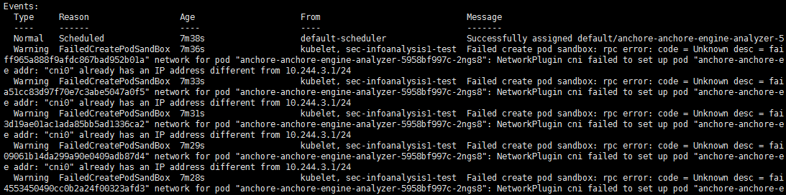

## 1. 因重置node后导致flannel报错的问题

### 1.1. 背景  

使用kubeadm reset重置node后，在kubeadm join加入集群，创建pod的时候，发现如下错误：  

```bash
Failed create pod sandbox: rpc error: code = Unknown desc = failed to set up sandbox container "6b3b6f0758f193395f3bda06e64c583ac9c5ff965a888f9afdc867bad952b01a" network for pod "anchore-anchore-engine-analyzer-5958bf997c-2ngs8": NetworkPlugin cni failed to set up pod "anchore-anchore-ee addr: "cni0" already has an IP address different from 10.244.3.1/24
```



### 1.2. 解决方法  

这些问题的原因是flannel 网络问题，最简单的方法就是把node重新reset。方法如下：  

```
# kubeadm reset
[reset] WARNING: Changes made to this host by 'kubeadm init' or 'kubeadm join' will be reverted.
[reset] Are you sure you want to proceed? [y/N]: y
[preflight] Running pre-flight checks
W1025 10:16:01.329478     393 removeetcdmember.go:79] [reset] No kubeadm config, using etcd pod spec to get data directory
[reset] No etcd config found. Assuming external etcd
[reset] Please, manually reset etcd to prevent further issues
[reset] Stopping the kubelet service
[reset] Unmounting mounted directories in "/var/lib/kubelet"
[reset] Deleting contents of config directories: [/etc/kubernetes/manifests /etc/kubernetes/pki]
[reset] Deleting files: [/etc/kubernetes/admin.conf /etc/kubernetes/kubelet.conf /etc/kubernetes/bootstrap-kubelet.conf /etc/kubernetes/controller-manager.conf /etc/kubernetes/scheduler.conf]
[reset] Deleting contents of stateful directories: [/var/lib/kubelet /etc/cni/net.d /var/lib/dockershim /var/run/kubernetes]

The reset process does not reset or clean up iptables rules or IPVS tables.
If you wish to reset iptables, you must do so manually.
For example:
iptables -F && iptables -t nat -F && iptables -t mangle -F && iptables -X

If your cluster was setup to utilize IPVS, run ipvsadm --clear (or similar)
to reset your system's IPVS tables.

The reset process does not clean your kubeconfig files and you must remove them manually.
Please, check the contents of the $HOME/.kube/config file.
# ifconfig  cni0 down
# yum install bridge-utils
# brctl delbr cni0
# ip link delete flannel.1
# kubeadm join --token=6nq2co.yjttt4y6udrraq3s 192.168.47.146:6443 --discovery-token-unsafe-skip-ca-verification
```
