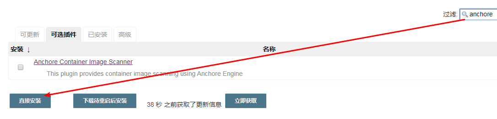
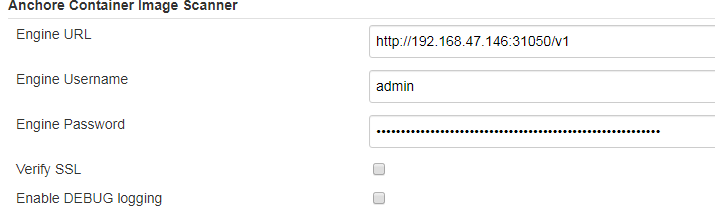
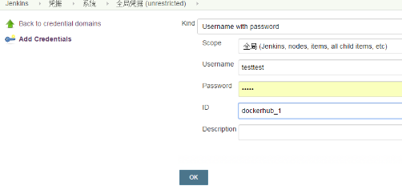
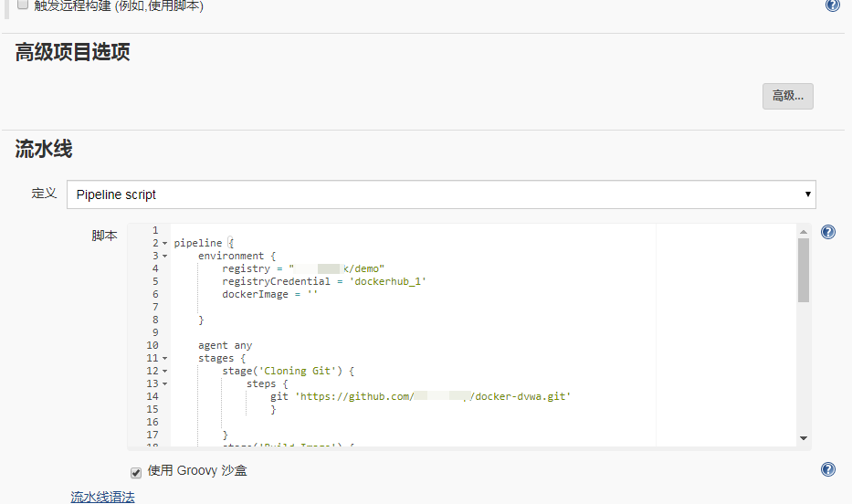
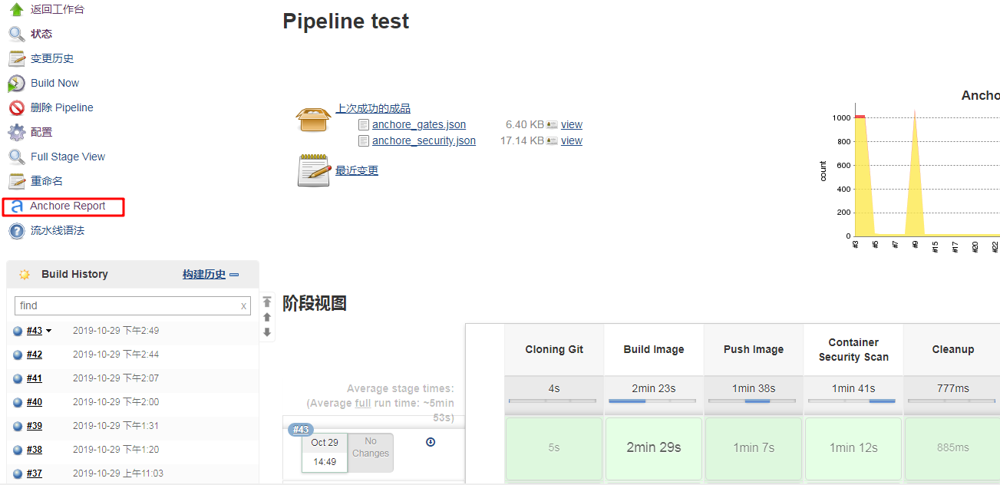
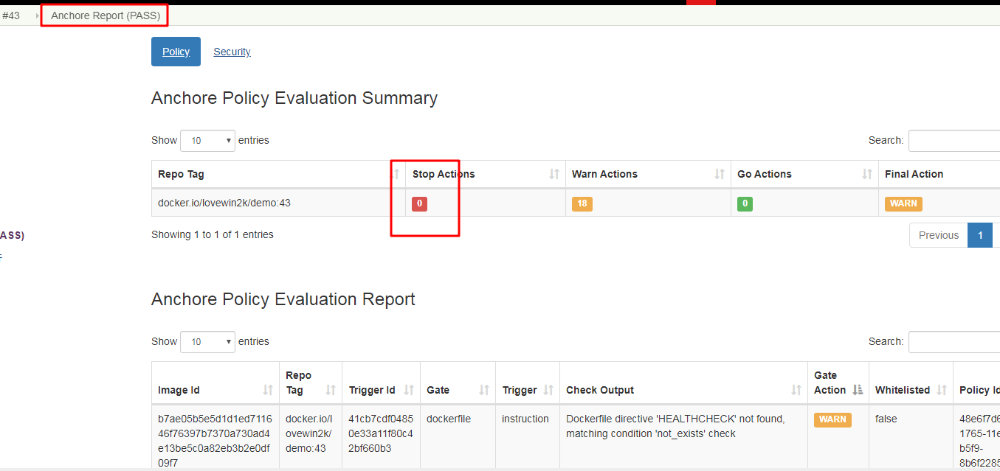

## 1. 如何使用anchore+Jenkins进行镜像扫描

### 1.1. 安装插件  

从Jenkins主菜单中选择Manage Jenkins。  

  

单击【可选插件】选项卡，然后过滤框里输入【anchore】，然后单击【直接安装】，安装过程中无须选中【安装完成后重启Jenkins(空闲时)】  

  

 

### 1.2. anchore插件配置  

从【Manage Jenkins】菜单中选择【configure system】，找到【Anchore Container Image Scanner】，按照实际情况填写：

- Engine URL：anchore引擎url地址

- Engine Username：用户名

- Engine Password：密码

  


### 1.3. 添加docker仓库帐号

点击凭据->系统->全局凭据->Add Credentials，添加一个docker  hub的帐号，id填写dockerhub_1。点击【ok】完成添加  

  

### 1.4. 把Anchore添加到构建过程  

可以把anchore添加到pipe line或者freestyle，下面以pipeline为例说明构建过程：  

新建一个任务，并选择pipe line，在【流水线】里输入以下脚本后确定，其中bailOnFail=false表示就算存在高危漏洞，构建过程也会标识成成功。bailOnPluginFail=false表示如果anchore服务器连不上，或者扫描插件存在错误，构建过程依然标识成功。

```
pipeline {
    environment {
        registry = "zj1244/demo"  //仓库地址，默认使用docker hub。按照实际情况修改
        registryCredential = 'dockerhub_1'  //登陆仓库用户名密码，按照实际情况修改
         
    }
     
    agent any
    stages {   
        stage('Cloning Git') {
            steps {
                git 'https://github.com/tahmed11/docker-dvwa.git'
                }
             
        }
        stage('Build Image') {
            steps {
                script {
                    app = docker.build(registry+ ":$BUILD_NUMBER")
                }
            }
        }
        stage('Push Image') {
            steps {
                script {
                    docker.withRegistry('', registryCredential ) {
                        app.push()
                    }
                }
            }
        }
        stage('Container Security Scan') {
            steps {
                 
                sh 'echo "'+registry+':$BUILD_NUMBER `pwd`/Dockerfile" > anchore_images'
                anchore engineRetries: "120", bailOnFail: false, bailOnPluginFail: false, name: 'anchore_images'
                //anchore name: 'anchore_images'
                 
            }
             
        }
        stage('Cleanup') {
             steps {
             sh script: "docker rmi " + registry+ ":$BUILD_NUMBER"
             }
              
        }
 
         
    }
}
```  

  

点击【Build now】进行构建，构建完成后可以点击【Anchore Report】查看扫描报告  

  


该报告显示摘要信息以及扫描结果的详细列表：  

  

### 1.5. 参考  

https://jenkins.io/doc/pipeline/steps/anchore-container-scanner/  
https://dzone.com/articles/anchore-container-image-scanner-jenkins-plugin  
https://medium.com/faun/step-by-step-guide-to-integrate-opensource-container-security-scanner-anchore-engine-with-cicd-580da8db5dfc  
https://anchore.com/integrating-anchore-scanning-into-jenkins-pipeline-via-jenkinsfile/  
https://wiki.jenkins.io/display/JENKINS/Anchore+Container+Image+Scanner+Plugin