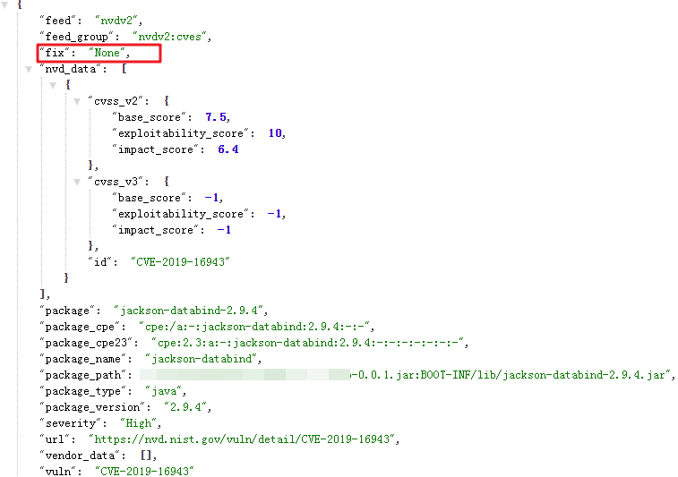
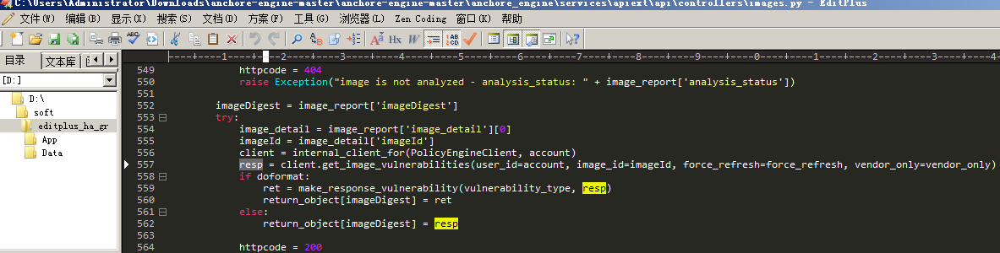
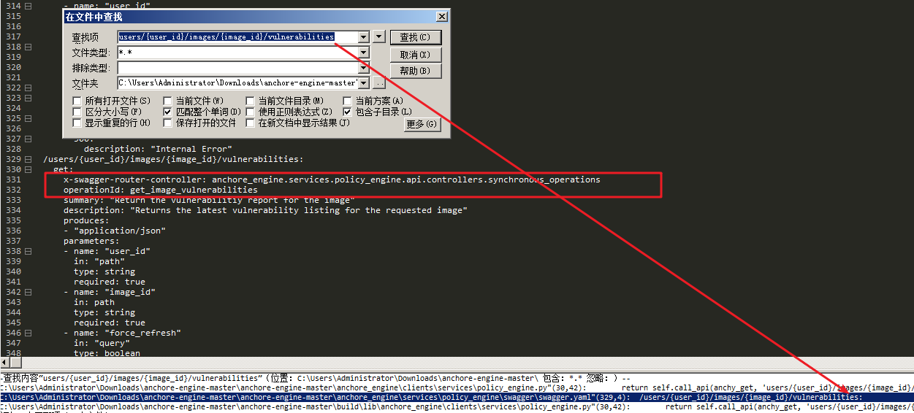
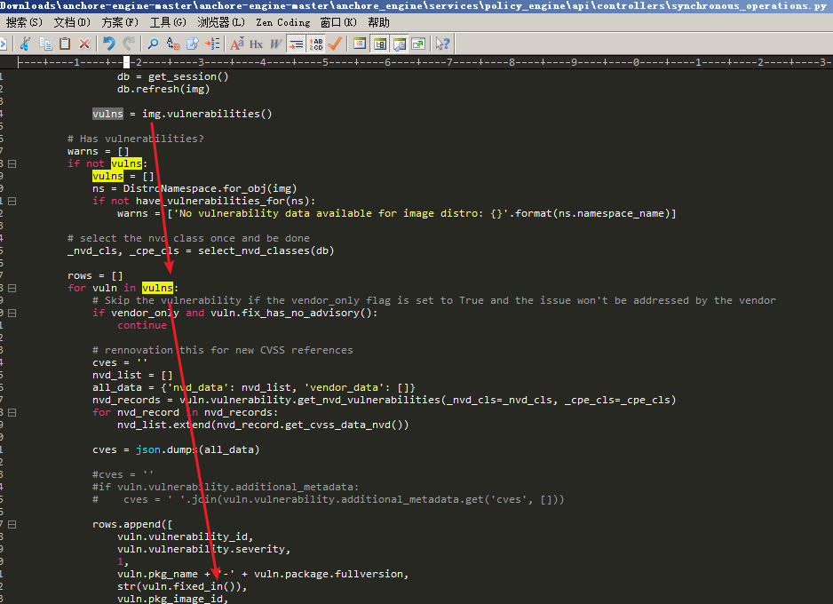
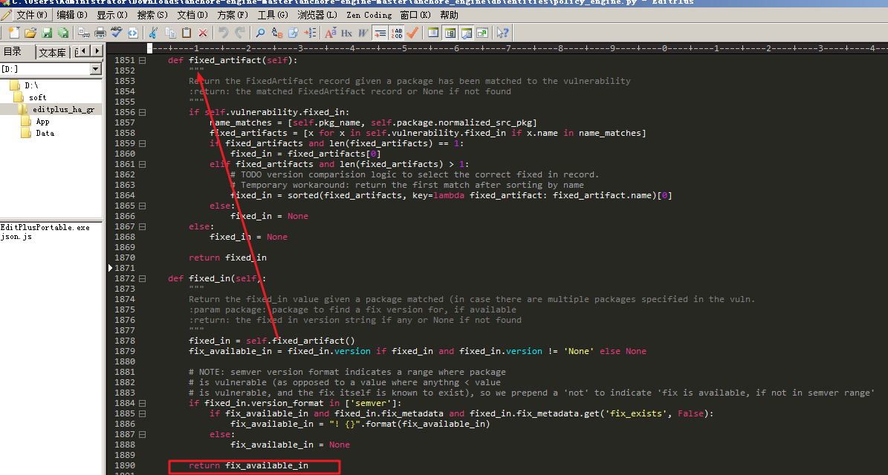
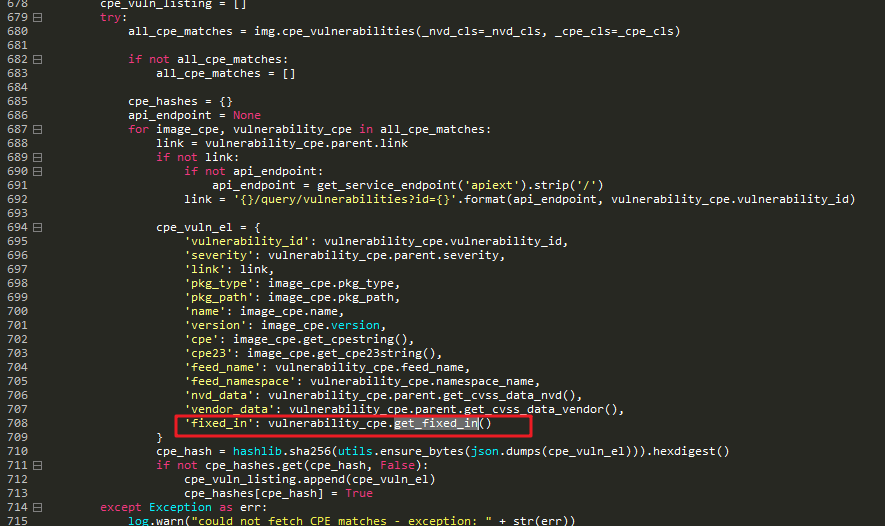
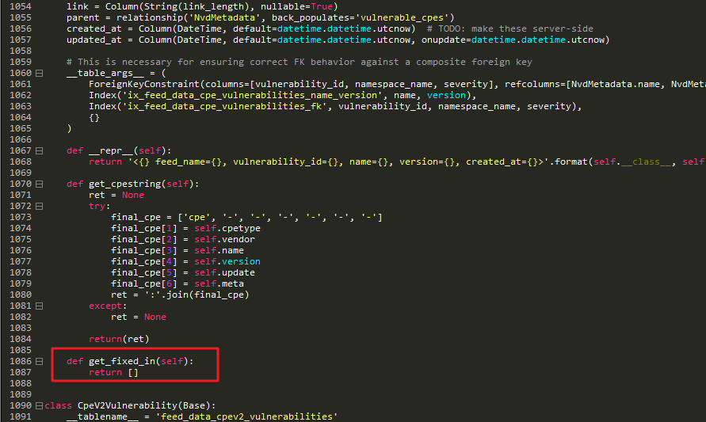
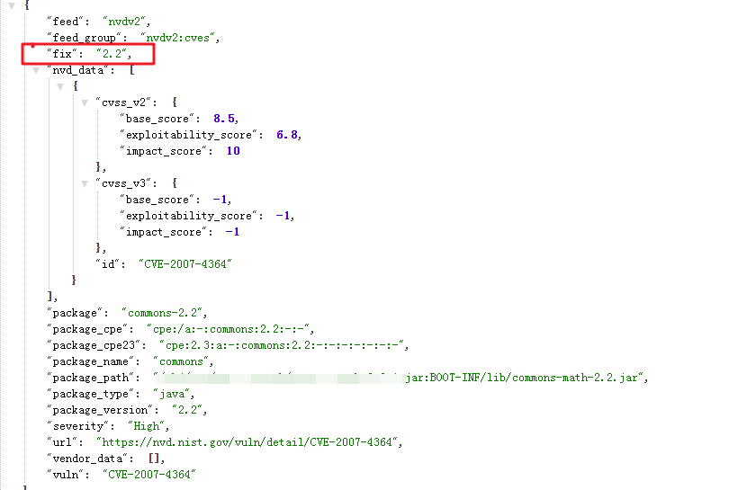
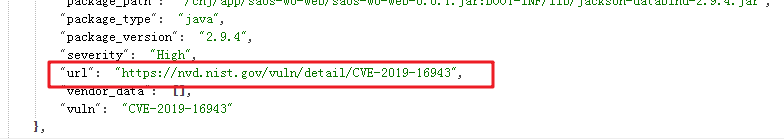
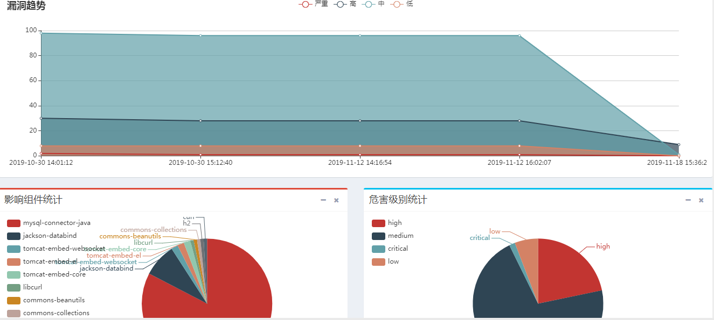

## 如何解决anchore对于nvdv2没有修复版本的问题

### 起因

使用anchore扫描镜像后，发现nvdv2类型的漏洞都没有修复版本，所以这就造成了在修复漏洞的时候造成的不便  

接口地址：http://192.168.47.144:8228/images/by_id/454010c206d656fd57da9c7bb4aba3cf81afd04aafdb826b50c6db71d07000d9/vuln/all  

  

### 分析  

之后想的解决办法是从数据库里找哪个字段是存修复版本的，然后写个脚本把修复版本补进去。后来发现数据库里根本没有存nvdv2类型的修复版本，这里顺带提一句，对于feed为vulnerabilities的漏洞，修复版本存在feed_data_vulnerabilities_fixed_artifacts的version字段。  
  
 具体分析如下：  
 
从接口分析，分析得出接口调用的是get_image_vulnerabilities_by_type_imageId函数  

  

调用关系是：get_image_vulnerabilities_by_type_imageId->get_image_vulnerabilities_by_type->vulnerability_query->client.get_image_vulnerabilities  

resp的内容就是镜像的漏洞结果
  

那get_image_vulnerabilities做了哪些事情，继续分析。有两个地方定义了get_image_vulnerabilities，分别在：  

- /opt/rh/rh-python36/root/usr/lib/python3.6/site-packages/anchore_engine/services/policy_engine/api/controllers/synchronous_operations.py

- /opt/rh/rh-python36/root/usr/lib/python3.6/site-packages/anchore_engine/clients/services/policy_engine.py  

这里先通过clients/services/policy_engine.py的get_image_vulnerabilities向users/{user_id}/images/{image_id}/vulnerabilities接口提交一个请求，从分析anchy_get得出是把请求发送到了engine-policy-engine  
  

  

查找users/{user_id}/images/{image_id}/vulnerabilities，通过swagger.yaml看出处理这个请求的函数是anchore_engine.services.policy_engine.api.controllers.synchronous_operations的get_image_vulnerabilities，也叫get_image_vulnerabilities。  
  

那我们看看get_image_vulnerabilities做了什么，函数通过img.vulnerabilities()从数据库里获取feed等于vulnerabilities的漏洞信息，然后存到rows列表里，其中的vuln.fixed_in()就是获取数据库里feed=vulnerabilities的修复版本  
  

继续看fixed_in做了什么，fixed_in在/opt/rh/rh-python36/root/usr/lib/python3.6/site-packages/anchore_engine/db/entities/policy_engine.py定义，通过fixed_artifact获取到修复版本，而fixed_artifact是查询了数据库里的feed_data_vulnerabilities_fixed_artifacts表，对于feed是vulnerabilities的修复版本如何获取的分析告一段落。
  

对于feed是nvdv2的漏洞，在synchronous_operations.py的get_image_vulnerabilities函数中做了另外一种处理，通过get_fixed_in来获取修复版本  
  

那看看get_fixed_in做了什么，get_fixed_in在/opt/rh/rh-python36/root/usr/lib/python3.6/site-packages/anchore_engine/db/entities/policy_engine.py定义，通过查找get_fixed_in会发现这个文件里定义了3个get_fixed_in，其中控制feed是nvdv2的修复版本的是1086行的那个，从代码里可以看到这里直接返回了空  
  

为了验证分析是否正确，所以把return []改成return ['2.2']，看看结果是否有变化：  
  

从结果看，确实是在这里控制修复版本的输出，所以可以在这里添加代码达到目的。
但是如果使用这种方法，会对程序有侵入性，并且还要修改数据库，新增一个修复版本字段，很麻烦。
所以我换了个办法，想着能在哪些存修复信息对程序影响最小，最后选择了放在url里，可以在url里加个锚点。
如：http://xxx/cve-2019-1234#1.20，这样既可以存数据又不会影响本来的url。  

  

当时想着写个脚本把数据库里的所有nvdv2的漏洞全部加上版本，但是后来发现一个漏洞可以对应多个版本号，并且有些是包含，有的是不包含，就算把所有版本提取出来加到url后面，对于包含和不包含的区分也比较麻烦。最后还是放弃了这个思路。
  

### 结论：  

刚开始对于修复版本，是通过获取到`https://nvd.nist.gov/`获取到相应的版本号，接着判断此版本号是including的话，就在最后一位版本加1就变成了修复版本，如：17.12变成17.13，是excluding的话就是修复版本。但是后来又发现这种办法在大部分的情况下是对的，但是有的情况是修复版本不是简单的17.12变成17.13，而是17.12.1。所以这种获取修复版本的思路也不理想。最终的思路是：  
1. 通过`https://nvd.nist.gov/`获取受影响的版本号  
2. 通过受影响组件名字和受影响版本号去`https://mvnrepository.com/`获取受影响组件的受影响版本号的下一个版本号，这个版本号就是修复版本的版本号  
  

**最后给个效果图**：  

