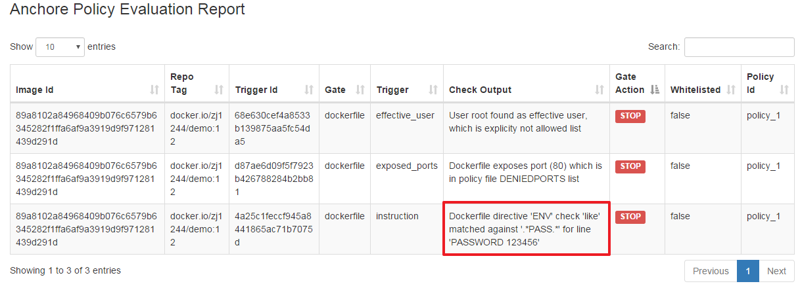
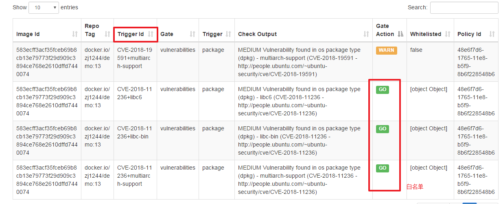

## 1. 如何为anchore添加扫描策略

### 1.1. 常用命令  

* 查看policy情况  

```
#  anchore-cli  --u admin --p 123 --url http://192.168.47.123:31050/v1  policy list
```  

* 激活策略，需要激活才能在jenkins上体现出来  

```
# anchore-cli  --u admin --p 123 --url http://192.168.47.123:31050/v1  policy activate policy-check-env
```  

* 导出策略  

```
# anchore-cli --u admin --p 123 --url http://192.168.47.123:31050/v1 policy get 2c53a13c-1765-11e8-82ef-23527761d060 --detail > policybundle.json
```  

* 执行策略扫描  

```
# anchore-cli  --u admin --p 123 --url http://192.168.47.123:31050/v1  evaluate check zj1244/demo:10 --policy policy-check-env --detail
```  

* 添加策略  

```
# anchore-cli  --u admin --p 123 --url http://192.168.47.123:31050/v1  policy add anchore_policy.json
``` 

* 删除策略  

```
# anchore-cli  --u admin --p 123 --url http://192.168.47.123:31050/v1  policy del policy-check-env
```  

### 1.2. 扫描dockerfile里是否存在敏感信息  

#### 1.2.1. 添加一个策略  

来添加一个最简单的策略，作用是查找dockerfile里是否存在password环境变量：  

```json
{
    "blacklisted_images": [],
    "comment": "Default bundle",
    "id": "policy-check-env",
    "mappings": [
        {
            "image": {
                "type": "tag",
                "value": "*"
            },
            "name": "default",
            "policy_id": "policy_1",
            "registry": "*",
            "repository": "*",
            "whitelist_ids": [
            ]
        }
    ],
    "name": "Critical Security Policy",
    "policies": [
        {
            "comment": "Critical vulnerability,  secrets, and best practice violations",
            "id": "policy_1",
            "name": "default",
            "rules": [
                
		{
                    "action": "STOP",
                    "gate": "dockerfile",
                    "id": "test_1",
                    "params": [
		    {
			      "name": "instruction", 
			      "value": "ENV" //触发哪个指令
			}, 
			{
			"name": "check",
			"value": "like"
			},
			{
			"name": "value",
			"value": ".*PASS.*"
			}
                    ],
                    "trigger": "instruction" //使用哪种触发器
                }

                
            ],
            "version": "1_0"
        }
    ],
    "version": "1_0",
    "whitelisted_images": [],
    "whitelists": [
        
    ]
}

```    

#### 1.2.2. 添加策略  

```
# anchore-cli  --u admin --p 123 --url http://192.168.47.123:31050/v1  policy add anchore_policy.json
Policy ID: policy-check-env
Active: False
Source: local
Created: 2020-03-30T07:58:32Z
Updated: 2020-03-30T07:58:32Z

```    

#### 1.2.3. 激活策略  

```
# anchore-cli  --u admin --p 123 --url http://192.168.47.123:31050/v1  policy activate policy-check-env
Success: policy-check-env activated
```  

#### 1.2.4. 执行扫描  

```
# 3. anchore-cli  --u admin --p 123 --url http://192.168.47.123:31050/v1  evaluate check zj1244/demo:10 --policy policy-check-env --detail
Image Digest: sha256:dc083990823a30faa6d5f8b425f9fb52bca4341e7f12d2f9f59773dce9cd04ad
Full Tag: docker.io/zj1244/demo:10
Image ID: 780c008ae27248223c23a7e2e3259915fa97adc6c052489d0ff96999e466b21e
Status: fail
Last Eval: 2020-03-30T08:01:50Z
Policy ID: policy-check-env
Final Action: stop
Final Action Reason: policy_evaluation

Gate              Trigger            Detail                                                                                               Status        
dockerfile        instruction        Dockerfile directive 'ENV' check 'like' matched against '.*PASS.*' for line 'PASSWORD 123456'        stop          

```  

#### 1.2.5. jenkins构建  

当使用jenkins构建的时候，也可以看到策略生效  

  

### 1.3. 添加白名单  

直接给出json文件：  

```
{
    "blacklisted_images": [], 
    "comment": "Default bundle", 
    "id": "2c53a13c-1765-11e8-82ef-23527761d060", 
    "mappings": [
        {
            "id": "c4f9bf74-dc38-4ddf-b5cf-00e9c0074611", 
            "image": {
                "type": "tag", 
                "value": "*"
            }, 
            "name": "default", 
            "policy_id": "48e6f7d6-1765-11e8-b5f9-8b6f228548b6", 
            "registry": "*", 
            "repository": "*", 
            "whitelist_ids": [
                "37fd763e-1765-11e8-add4-3b16c029ac5c"  //和下面白名单的id对应
            ]
        }
    ], 
    "name": "Default bundle", 
    "policies": [
        {
            "comment": "System default policy", 
            "id": "48e6f7d6-1765-11e8-b5f9-8b6f228548b6", 
            "name": "DefaultPolicy", 
            "rules": [
                {
                    "action": "STOP", 
                    "gate": "dockerfile", 
                    "id": "ce7b8000-829b-4c27-8122-69cd59018400", 
                    "params": [
                        {
                            "name": "ports", 
                            "value": "22"
                        }, 
                        {
                            "name": "type", 
                            "value": "blacklist"
                        }
                    ], 
                    "trigger": "exposed_ports"
                }, 
                {
                    "action": "WARN", 
                    "gate": "dockerfile", 
                    "id": "312d9e41-1c05-4e2f-ad89-b7d34b0855bb", 
                    "params": [
                        {
                            "name": "instruction", 
                            "value": "HEALTHCHECK"
                        }, 
                        {
                            "name": "check", 
                            "value": "not_exists"
                        }
                    ], 
                    "trigger": "instruction"
                }, 
                {
                    "action": "WARN", 
                    "gate": "vulnerabilities", 
                    "id": "6b5c14e7-a6f7-48cc-99d2-959273a2c6fa", 
                    "params": [
                        {
                            "name": "max_days_since_sync", 
                            "value": "2"
                        }
                    ], 
                    "trigger": "stale_feed_data"
                }, 
                {
                    "action": "WARN", 
                    "gate": "vulnerabilities", 
                    "id": "3e79ea94-18c4-4d26-9e29-3b9172a62c2e", 
                    "params": [], 
                    "trigger": "vulnerability_data_unavailable"
                }, 
                {
                    "action": "WARN", 
                    "gate": "vulnerabilities", 
                    "id": "6063fdde-b1c5-46af-973a-915739451ac4", 
                    "params": [
                        {
                            "name": "package_type", 
                            "value": "all"
                        }, 
                        {
                            "name": "severity_comparison", 
                            "value": "="
                        }, 
                        {
                            "name": "severity", 
                            "value": "medium"
                        }
                    ], 
                    "trigger": "package"
                }, 
                {
                    "action": "STOP", 
                    "gate": "vulnerabilities", 
                    "id": "b30e8abc-444f-45b1-8a37-55be1b8c8bb5", 
                    "params": [
                        {
                            "name": "package_type", 
                            "value": "all"
                        }, 
                        {
                            "name": "severity_comparison", 
                            "value": ">"
                        }, 
                        {
                            "name": "severity", 
                            "value": "medium"
                        }
                    ], 
                    "trigger": "package"
                }
            ], 
            "version": "1_0"
        }
    ], 
    "version": "1_0", 
    "whitelisted_images": [], 
    "whitelists": [
        {
            "comment": "Default global whitelist", 
            "id": "37fd763e-1765-11e8-add4-3b16c029ac5c", 
            "items": [

{
        "gate": "vulnerabilities",
        "trigger_id": "CVE-2018-11236+*",
        "id": "rule2"
      }
		], 
            "name": "Global Whitelist", 
            "version": "1_0"
        }
    ]
}

```

trigger_id支持正则，里面的内容可以通过jenkins里的报告查出来  

  

### 1.4. 参考：  

https://docs.anchore.com/current/docs/engine/usage/cli_usage/policies/policy_gate_dockerfile/#trigger-instruction  
https://mydeveloperplanet.com/2019/02/27/anchore-container-image-scanner-jenkins-plugin/  
https://docs.anchore.com/current/docs/overview/concepts/policy/policy_checks/#introduction  
https://anchore.com/using-anchore-to-identify-secrets-in-container-images/  
https://anchore.com/enforcing-alpine-linux-docker-images-vulnerability-cve-2019-5021-with-anchore/  
https://github.com/cloudbees-days/anchore-scan/blob/master/.anchore_policy.json
