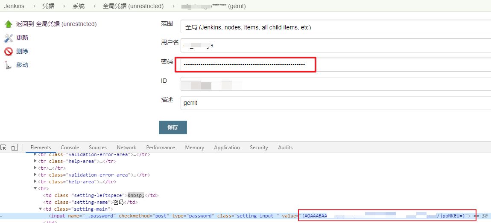
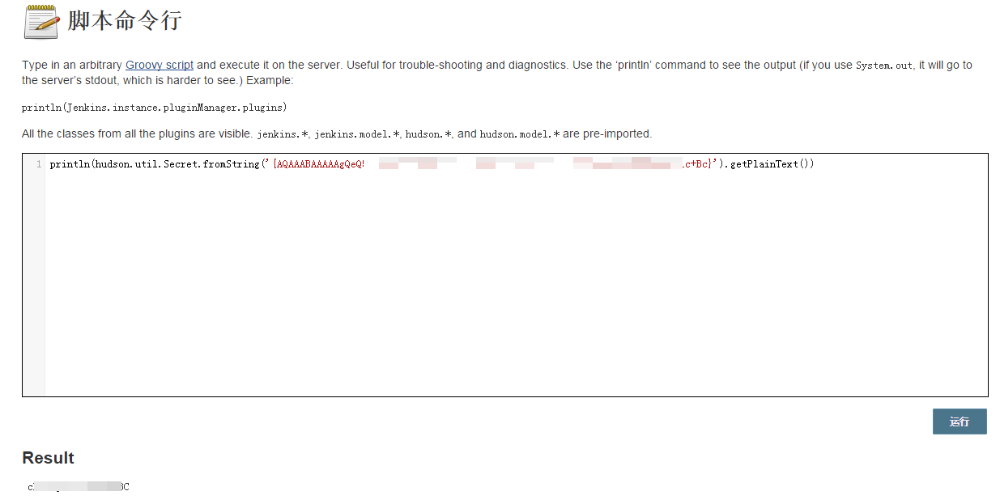

## 1. 如何解密jenkins的凭证

### 1.1. 前提  

需要可以执行script  

### 1.2. 获得加密后的凭据

通过访问凭据->系统->全局凭据->某个凭据->更新来查看加密后的凭据  



### 1.3. 解密  

点击系统管理->命令脚本行，输入如下代码，即可查看密码  

```
println(hudson.util.Secret.fromString('xxxxxxxxxxxxxxxxxxxx').getPlainText())
```  

或者  

```
println(hudson.util.Secret.decrypt("xxxxxxxxxxxxxxx"))
```  



### 1.4. 参考：  

https://fortynorthsecurity.com/blog/the-security-of-devsecops-jenkins/
