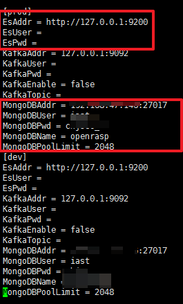
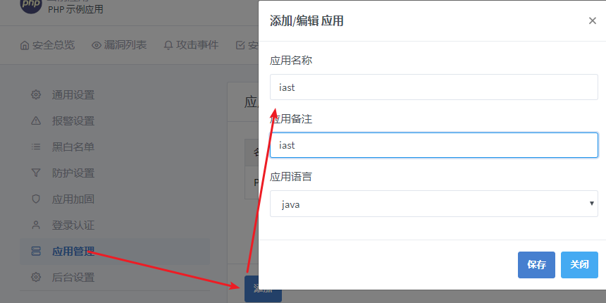
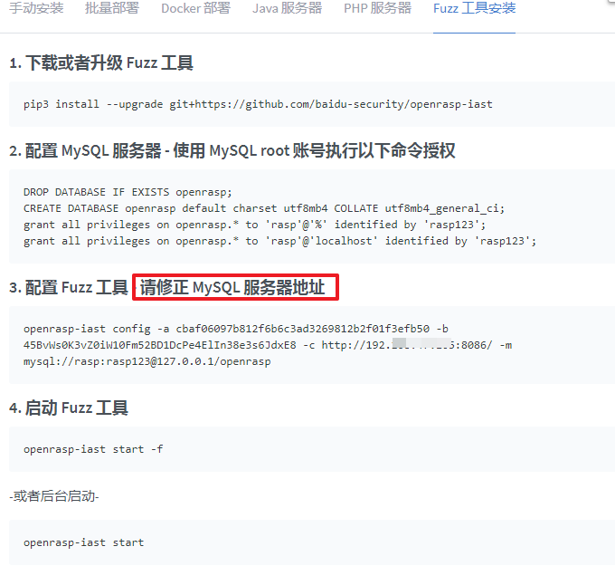
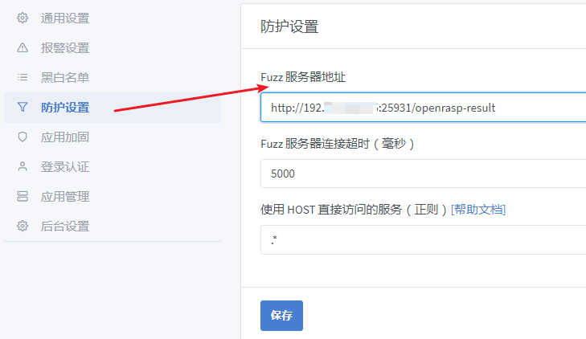
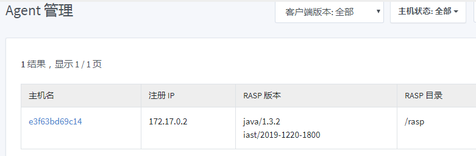
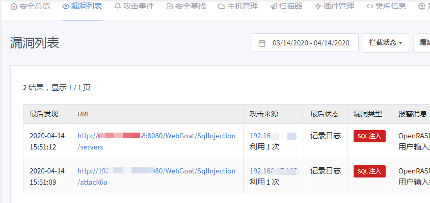

## 如何部署百度iast

### 环境要求

首先需要三个数据库，mysql、Elasticsearch和MongoDB，es用来存储报警和统计信息，mongo用来存储应用、账号密码等信息。
目前对数据库的要求是：  

* MongoDB版本大于等于3.6
* ElasticSearch版本大于等于5.6，小于7.0  

### 添加mongo用户  

mongodb和es安装过程省略，测试可以用docker  

```
> use openrasp
> db.createUser({user:'iast',pwd:'123456', roles:["readWrite", "dbAdmin"]})
```  

### 安装管理后台  

```
# wget https://packages.baidu.com/app/openrasp/release/1.3.2/rasp-cloud.tar.gz
# tar -zxvf rasp-cloud.tar.gz
# cd rasp-cloud-2020-03-25/
# vim conf/app.conf
```  

修改app.conf文件里mongo和es的连接配置  

  

最后启动程序：  

```
# ./rasp-cloud
```  

或者  

```
# ./rasp-cloud -d //后台运行
```  

### IAST插件安装  

```
# wget https://packages.baidu.com/app/openrasp/openrasp-iast-latest -O /usr/bin/openrasp-iast
```  

配置MYSQL数据库，建立名为openrasp的数据库，并且为rasp@%授权，这里示例密码为rasp123，请自行修改为强密码。使用root账号连接mysql并执行如下语句：  

```
DROP DATABASE IF EXISTS openrasp;
CREATE DATABASE openrasp default charset utf8mb4 COLLATE utf8mb4_general_ci;
grant all privileges on openrasp.* to 'rasp'@'%' identified by 'rasp123';
grant all privileges on openrasp.* to 'rasp'@'localhost' identified by 'rasp123';
```  

点击应用管理->添加，应用名称和应用备注填入iast，应用语言选择java，点击保存  

  

在云控（8086那个端口）右上角添加主机->Fuzz工具安装，从第三步开始，注意改mysql地址：  

  

### 配置管理后台  

打开云控管理后台[http://ip:8086](http://ip:8086)，输入默认用户名密码：openrasp/admin@123
在插件管理中选择推送iast插件。  

  

接着在防护设置->Fuzz服务器地址里填入openrast-iast所监听的URL，端口使用默认，**一定要改IP**，不然会发现不到扫描任务：  

  

最后在系统设置->通用设置中，修改检测配置  

* 单个hook点最大执行时间设置为5000
* 开始文件过滤器：当文件不存在时不调用检测插件设置为关闭
* LRU大小设置为0  

点击保存  

### 安装agent  

下载webgoat.jar文件
链接：https://pan.baidu.com/s/1du-4XVlAfvk7S6q-8VF7gA 
提取码：4261   

新建Dockerfile  

```
# cat Dockerfile
FROM openjdk:11.0.1-jre-slim-stretch

ARG webgoat_version=v8.0.0-SNAPSHOT

RUN \
  apt-get update && apt-get install && \
  useradd --home-dir /home/webgoat --create-home -U webgoat
ADD https://packages.baidu.com/app/openrasp/release/1.3.2/rasp-java.tar.gz /tmp
RUN cd /tmp \
    && tar -xf rasp-java.tar.* \
    && mv rasp-*/rasp/ /rasp/ \
    && rm -f rasp-java.tar.gz

RUN echo "cloud.enable: true" >> /rasp/conf/openrasp.yml \
    && echo "cloud.backend_url: http://192.168.47.105:8086/" >> /rasp/conf/openrasp.yml \
    && echo "cloud.app_id: cbaf06097b812f6b6c3ad3269812b2f01f3efb50" >> /rasp/conf/openrasp.yml \
    && echo "cloud.app_secret: 45BvWs0K3vZ0iW10Fm52BD1DcPe4ElIn38e3s6JdxE8" >> /rasp/conf/openrasp.yml

COPY webgoat-server-8.0.0.M25.jar /home/webgoat/webgoat.jar
RUN mkdir -p /rasp/logs/rasp/
EXPOSE 8080

ENTRYPOINT ["java", "--add-opens","java.base/jdk.internal.loader=ALL-UNNAMED","-Djava.security.egd=file:/dev/./urandom","-javaagent:/rasp/rasp.jar", "-jar", "/home/webgoat/webgoat.jar"]
CMD ["--server.port=8080", "--server.address=0.0.0.0"]

```  

编译运行镜像  

```
# docker build -t webgoat:1 .
# docker run -p 8080:8080 webgoat:1
```  

### 测试效果  

在云控上点击主机管理，出现agent，说明agent部署成功  

  
  
访问[http://ip:8080/WebGoat](http://ip:8080/WebGoat)，随便操作一些功能，可以看到已经检测出漏洞  


