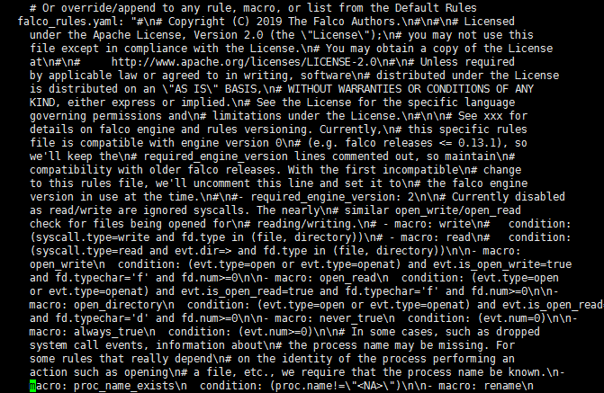
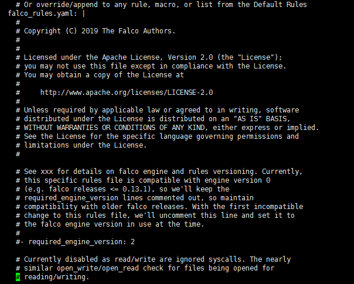

## 1. 解决falco规则的一个小bug

### 1.1. 现象

使用如下命令部署falco会出现一个问题，configmap的rules会因为存在`空格回车`字符而被转义，其结果就是如果要修改规则会很麻烦  

```
# helm install stable/falco --name falco --set ebpf.enabled=true,falco.jsonOutput=true,image.tag=0.23.0 
```  

使用命令`kubectl edit configmap falco`查看configmap，可以看到falco_rules.yaml被转义  

    

### 1.2. 原因

起初我还以为是因为文件太长了导致的压缩转义，后来测试发现原来是因为文件里存在【空格回车】字符  

  

把这些字符替换为空即可解决，替换后再查看configmap的falco_rules.yaml  
  
### 1.3. 解决

1. 首先把falco的chart给保存到本地
```
helm fetch stable/falco --untar
```  

2. 把falco_rules.yaml文件里的空格回车替换成空
```
vim falco/rules/falco_rules.yaml 
```  

3. 安装falco
```
helm install ./falco/ --name falco
```  

4. 查看configmap确认问题解决
```
kubectl edit configmap falco
```
