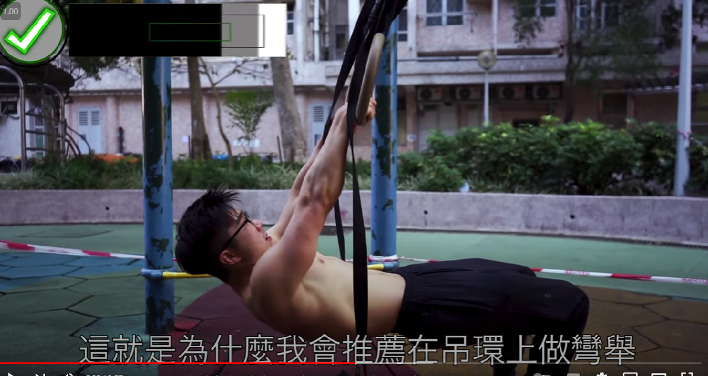
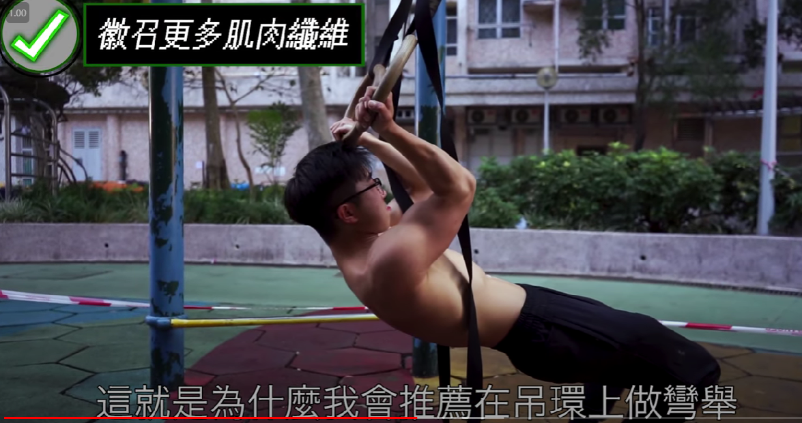
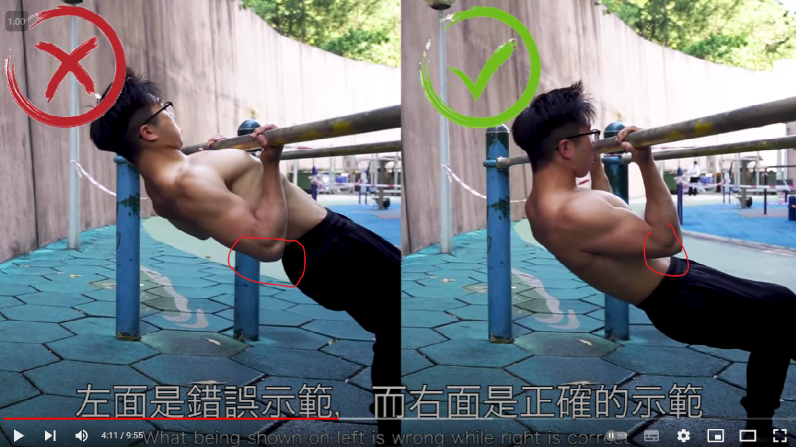
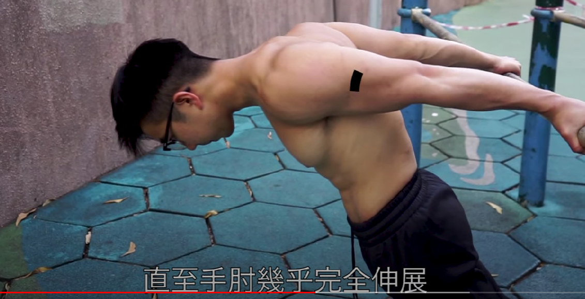
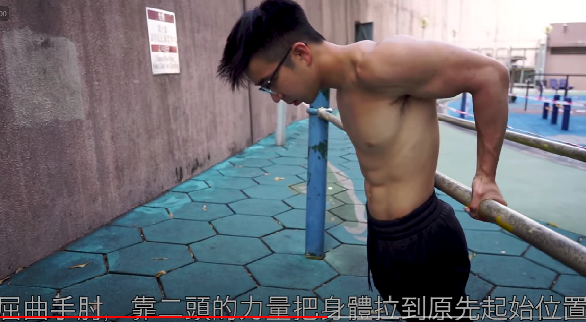
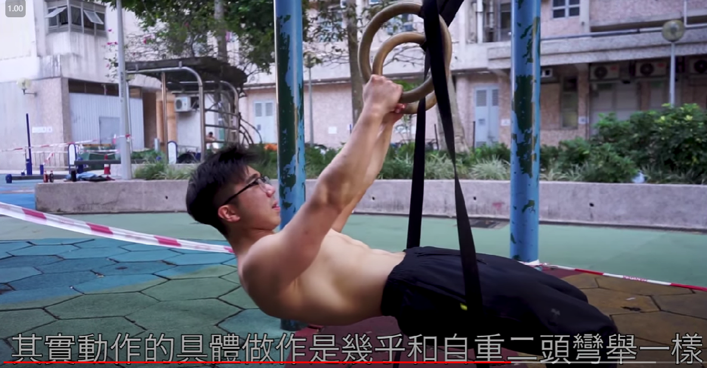
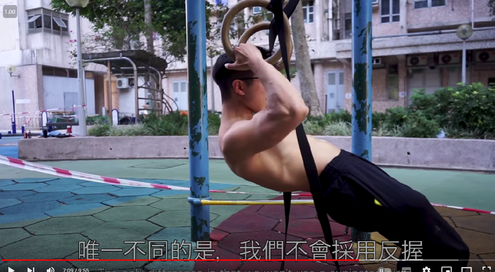
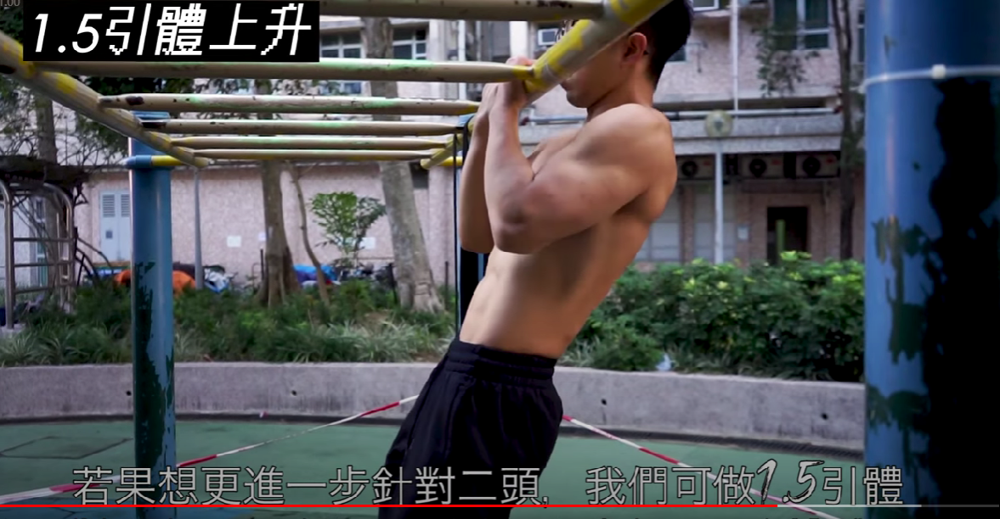
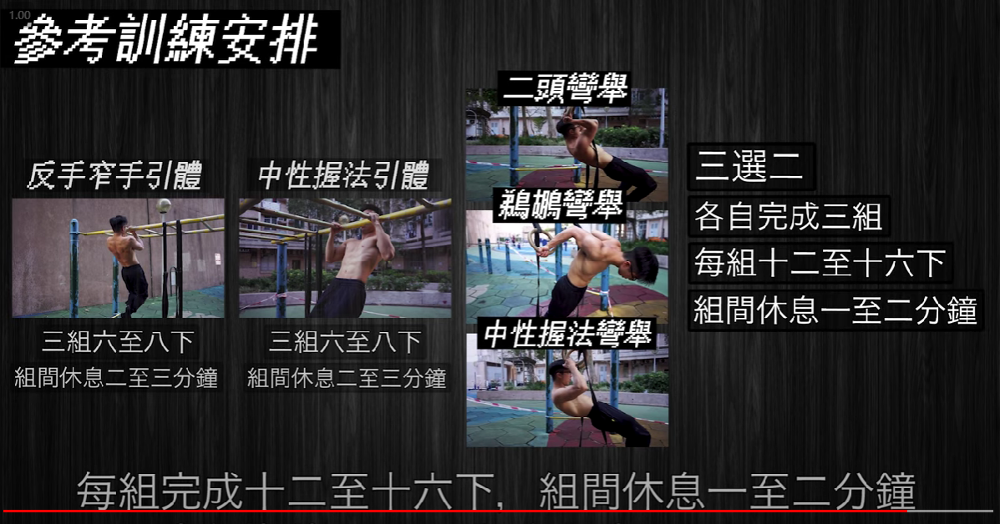

# 健身
## 吊环
### 二头肌
#### 动作一-二头弯举
开始

结束

#### 动作二-二头弯举
关键点是肘不能在身体后面，不然就是背部发力

#### 动作三-鹈鹕弯举
开始

结束

#### 动作四-对握弯举
重点是手心相对握法
开始

结束

#### 动作五-1.5倍反手窄手引体
从底拉到顶，然后再下来到一半的时候，再重新向上到顶，再到底算一个。

#### 训练安排
