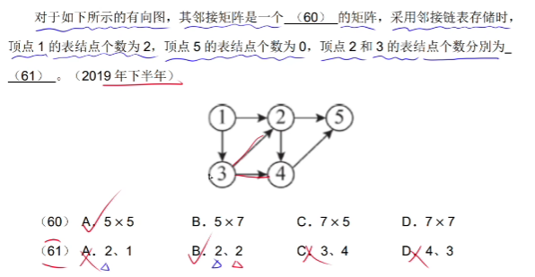

# 常见
## 霍夫曼
### 题目一

#### 解析
核心思想就是每次都取两个最小的数值
先去两个最小的数值14和16，然后画二叉树，规则是**小的在左边，大的在右边**  
```
     24
    /   \
10(b)   14(e)
```  
然后再以同样的方法取两个最小的数值构成二叉树的右边
```
     36
    /   \
16(d)   20(c)
```
再取两个最小的数值组成二叉树，现在是有24,36和40三个数，所以取24和36  
      

因为最后一个40比60小，所以把40放到64左边
  
然后左分支是0，右分支是1，所以就是  


那么编码情况就是
a:0
b:100
c:111
d:110
e:101

所以cade就是1110110101
### 题目二

#### 解析
先画出二叉树，核心思想还是取两个最小的数值，还有小的在左边，大的在右边，最终得到如下二叉树和对应编码

a:0
b:101
c:100
d:111
e:1101
f:1100

所以a和c的码长是1和3，110001001101对应的就是face
## tcp


## 待区分
### 题目一

#### 解析
5个点所以是5*5，顶点2和3分别有两个指向其他顶点的边，所以是2、2
### 题目二

#### 解析
b
### 题目三

#### 解析
macabe的复杂度是闭区间+1
### 题目三

#### 解析
这类题，记住总是先p在v，所以p1执行之后就肯定是v。然后关于p1到p2为什么是s1，简单理解p1到p2是12，p2到p3是23，p2到p4是24。按照从小到大标注就行
### 题目四  

#### 解析
先算括号里的，所以是ab-和cd+，然后ab-和cd+分别当整体，把*放后面，就得到d答案
### 题目五

#### 解析
acf天数是7天，而abf天数是9天，所以c不在关键路径上。
abehjl这条路径是20天，所以可以拖延两天
### 题目六

#### 解析
对于有两个地址的这类题，都要先求出范围（大-小+1），然后转换成十进制，所以：
```
1. cffffh-a0000h+1=30000h
2. 30000h=3*16的4次方=3*2的16次方
3. 因为题目是按照字节编址，所以还需要B转换成KB，也就是需要除以1024：3*2的16次方/1024=3*2的16次方/2的10次方=3*2的6次方=192KB
4. 192KB=192K*8bit，所以192K*8bit/64K*8bit=3
```
### 题目七

#### 解析
发现错误能力从弱到强：语句，判定，条件，判定条件，条件组合，路径
## 二叉树
### 题目一

#### 解析
先序遍历：第一个结点是根节点，遍历顺序是根左右
中序遍历：中间结点是根节点，遍历顺序是左根右
后序遍历：最后一个是根节点，遍历顺序是左右根

所以后序遍历的最后一个肯定是10，b和d错误。然后从中序遍历规则里得知，20和30是左边的树，50和40是右边的树。那么a的50和40就错误了，只有c的排序是对的，30和20在左边，50和40在右边，符合后序遍历的左右根
### 题目二

#### 解析
大顶堆就是特殊的完全二叉树，所以第一步先画出完全二叉树  
  
然后根据大顶堆的定义：根节点必须最大，依次从最底端比较。4比1大，所以4和1交换。  

## UML
### 用例图
#### 包含关系include
  
包含关系有点像前置条件的意思，本意是把经常被调用的子用例提取出来，然后其他功能执行前先执行他。例如：下单这个用例里就包含了用户登录、选择商品、填写订单信息、支付、完成订单等子用例，这些子用例也可以看做下单的前置条件
#### 扩展关系extend
  
就是处理一些特殊情况。例如购票“选票->付钱->出票->找零”本身是一个完整用例，但是在过程中可能出现零钱不足、缺票、用户中途取消等特殊状况，处理这些特殊状况的功能就是扩展关系
#### 泛化关系
  
就是父类和子类的关系，例如：付款和银行卡付款、二维码付款。建立迷宫和导入迷宫、新建迷宫。
### 类图

#### 泛化关系
和用例图的泛化关系一样，描述父类和子类的关系
#### 聚合关系
  
【聚合关系】：是整体与部分的关系，如车和轮胎是整体和部分的关系，汽车消失了，轮胎还是存在。是弱关联。  
【代码体现】：成员变量  
【箭头及指向】：带空心菱形的实心线，菱形指向整体
#### 组合关系
【组合关系】：组合关系是强关联，有一样的生命周期，比如：生命和大脑，没了生命，大脑也就没了  
【箭头及指向】：带实心菱形的实线，菱形指向整体

#### 关联关系
【关联关系】：是一种拥有的关系，它使一个类知道另一个类的属性和方法。如：老师与学生，丈夫与妻子
##### 单向关联

##### 双向关联

## 操作系统
### 题目一

#### 解析
这类题目想想答案数字和题目数字能有什么关系，直觉可以算下范围大-小+1。所以31-22+1=10,1024=2的10次方。以此类推，所以选d
### 题目三

#### 解析
数学题，一个块移动到另一个块的距离是5个磁道，也就是10ms，而且延时和传输时间的总和是11ms，所以总的时间是21ms，100块就是2100ms
## 算法
### 分治
分治是把复杂的大问题分成几个小问题的组合

处理问题：二分搜索、合并排序、快速排序、大整数乘法、Strassen矩阵乘法、棋盘覆盖、线性时间选择、最接近点对问题、循环赛日程表、汉诺塔
### 动态规划
动态规划是把已经算出来的小问题答案记下来，在下次接着用

关键字：最优子结构，重叠子问题

处理问题：最优三角形划分、爬楼梯、最小路径和、买卖股票的最佳时机、最长回文子串、最长上升子序列、最长公共子序列
### 贪心
贪心是在每一步上都找最优的解，在对问题求解时，总是做出在当前看来是最好的选择。也就是说，不从整体最优上加以考虑，它所做出的仅仅是在某种意义上的局部最优解。不能保证求得的最后解是最佳的。

处理问题：纸币找零、背包问题、最小生成树的Prim算法、Kruskal算法、霍夫曼编码、最短路径
### 回溯
回溯是指一旦发现这个选择不是最优或者达不到目标就往回退，以深度优先的方式搜索解空间树

处理问题：八皇后问题、简单迷宫、括号生成、通配符匹配
### 分支限界
和回溯法类似，不过是以广度优先或以最小耗费优先的方式搜索解空间树
### 题目一

#### 解析
死记硬背dijkstra是贪心算法。a到e的最短路径可以算出abe是9，ace是7，acfe是6，adf是5，所以选a
## java
### static
static是表示count是类变量的意思，而name变量是实例变量
```
public class MyClass {
   static int count = 0;
   String name;

   public MyClass(String name) {
      this.name = name;
      count++; // 每次实例化对象时，类属性count的值都会自增1
   }
}

```
### protected
访问修饰符，一般用于定义变量或者方法的访问权限
```
public class Animal {
    protected String name;

    protected void eat() {
        System.out.println("Animal is eating.");
    }
}

public class Cat extends Animal {
    public void jump() {
        System.out.println(name + " is jumping.");
    }
}

public class Main {
    public static void main(String[] args) {
        Cat cat = new Cat();
        cat.name = "Tom";
        cat.eat();
        cat.jump();
    }
}

```
### abstract
定义抽象类或者抽象方法，对于abstract方法，子类必须要实现。或者如果某个子类的父类是抽象类，那这个子类的方法有可能是abstract方法
```
// 抽象类 Animal
public abstract class Animal {
    public abstract void makeSound(); // 抽象方法
}

// 子类 Cat 继承自 Animal
public class Cat extends Animal {
    @Override //Java中的一个注解，用于表示该方法覆盖了父类或接口中的同名方法，可以帮助编译器检查方法是否正确地重写了父类或接口中的方法，可以选择不写
    public void makeSound() {
        System.out.println("喵喵叫");
    }
}

```
## 下午题
### 第一题
#### 第一问
找实体e1，实体都是名词
#### 第二问
找存储d1，存储都是什么什么+表  
  
d1就是用户/商户信息表
#### 第三问
一般几分就缺失几个数据流，数据流里起点或者终点一定要有P才正确
##### 上下文数据流图里的E里有多少个箭头，0层数据库图里也有要多少个箭头
下图的E3就缺少了一个餐单的数据流

##### 加工P要有输入和输出数据流，缺一不可
##### 存储D也要有输入和输出数据流
#### 第四问
##### 加工逻辑
按照逗号分割抄，然后遇到若、如果就用if  


##### 数据流组成

### 第二题
一个长方形里有两个竖线，是子实体的意思，一个长方形叫做一个实体，也就是一张表的意思。
#### 第一问 画联系图
根据需求分析结果画联系图


#### 第二问 补充属性和主键和外键
补充主键和外键，主键实线，外键虚线

1对多的模式中，要把1那一方的主键加到多这边当外键，如：
分公司和专卖店的关系中，把分公司编号（主键）加到专卖店里当外键

<<<<<<< HEAD
做题时候，把关系模式里的名称当成一张表，根据需求分析结果把缺少的属性先填上，然后再根据er图的联系检查是否有漏的。例如：
根据需求分析结果得知b空里缺少【地址，分公司编号 】，然后再看er图中，再看er图中业务部有三个联系，已经有了分公司编号属于分公司和业务部的联系，而业务部和职员的联系，业务部是1，所以不管。最后业务部和主管的联系中，需要把主管号写上。所以b的答案就是【地址，分公司编号 ，主管号】 
  
对于多对多的联系，需要转换成一个新的关系模式（表），关系模式（表）的属性（字段名）是双方的主键  


=======
>>>>>>> 7ddd423865daf460741ee2853342f7bbf698d98e
